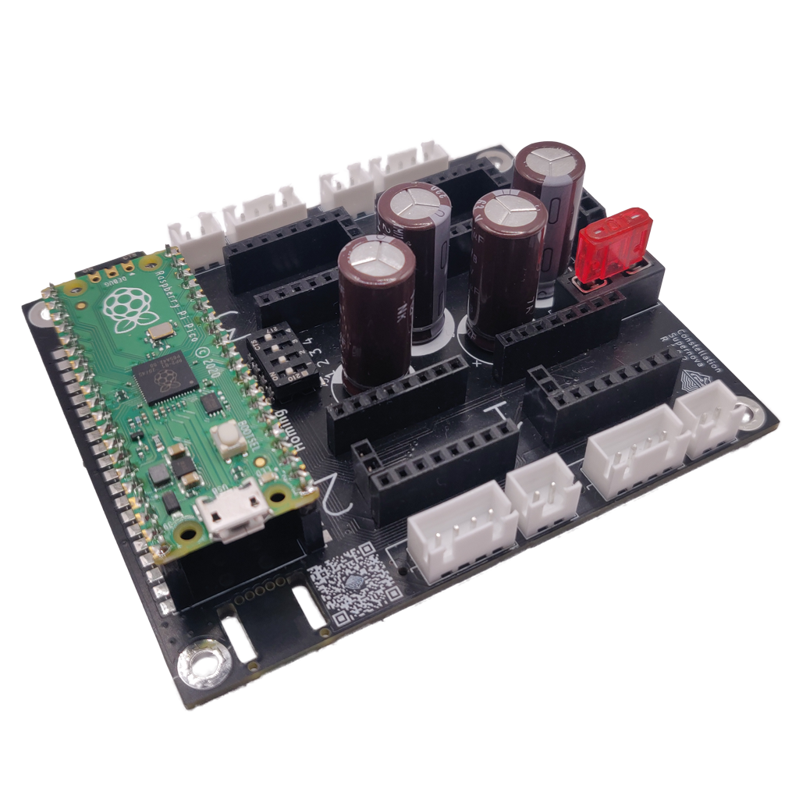

# Constellation
Constellation is a series of control boards, powered by the Raspberry Pi Pico board, developed by the team at ANNEX Engineering.

It is intentional that there are no gerbers/schematics/source files available for the forseeable future. This is to prevent clones popping up that use lower quality components.

## Supernova
 - Supernova, is a 4 stepper controller. 
 - Can drive steppers at 12v to 48v
 - Supports sensorless or switch based endstops
 - Standard Stepstick format supported only
 - Uses XH or Microfit connectors to connect to steppers, such that currents of 3A+ can be supported

 

 ## Sirius
 TBD

 ## Nebula
 TBD

Our discord server can be found here: 

