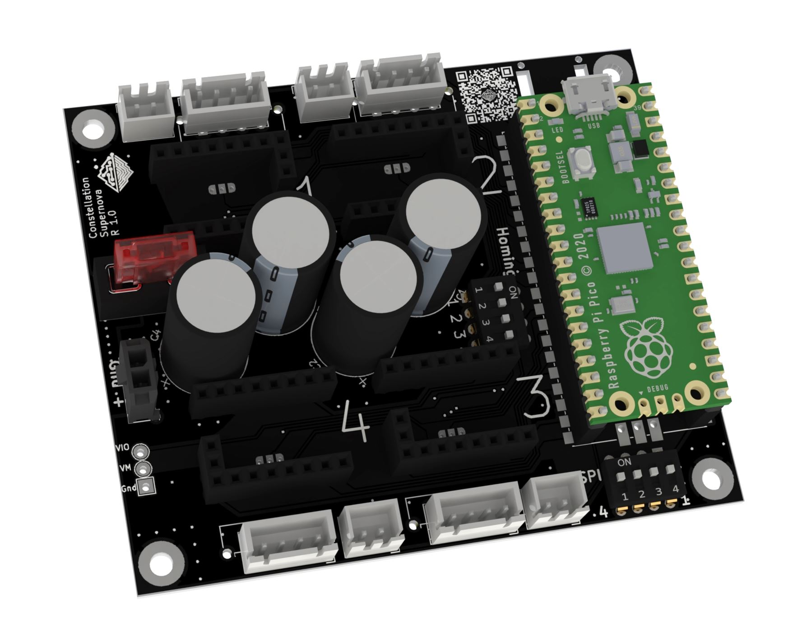
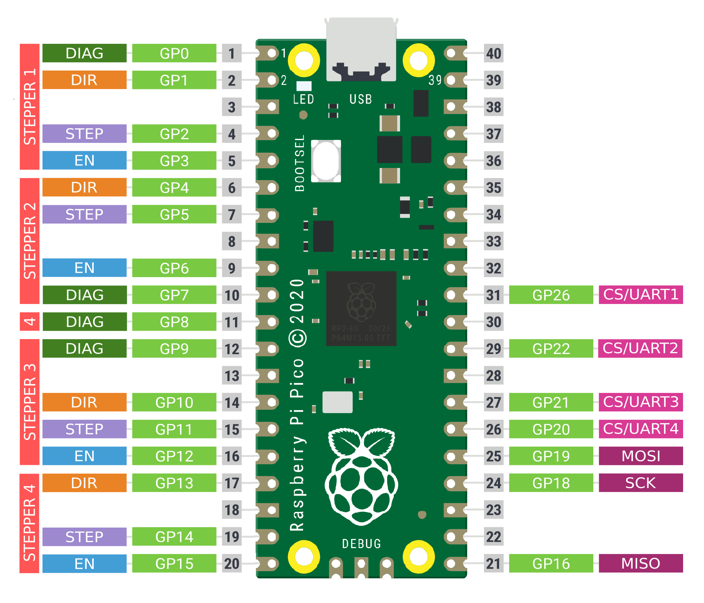
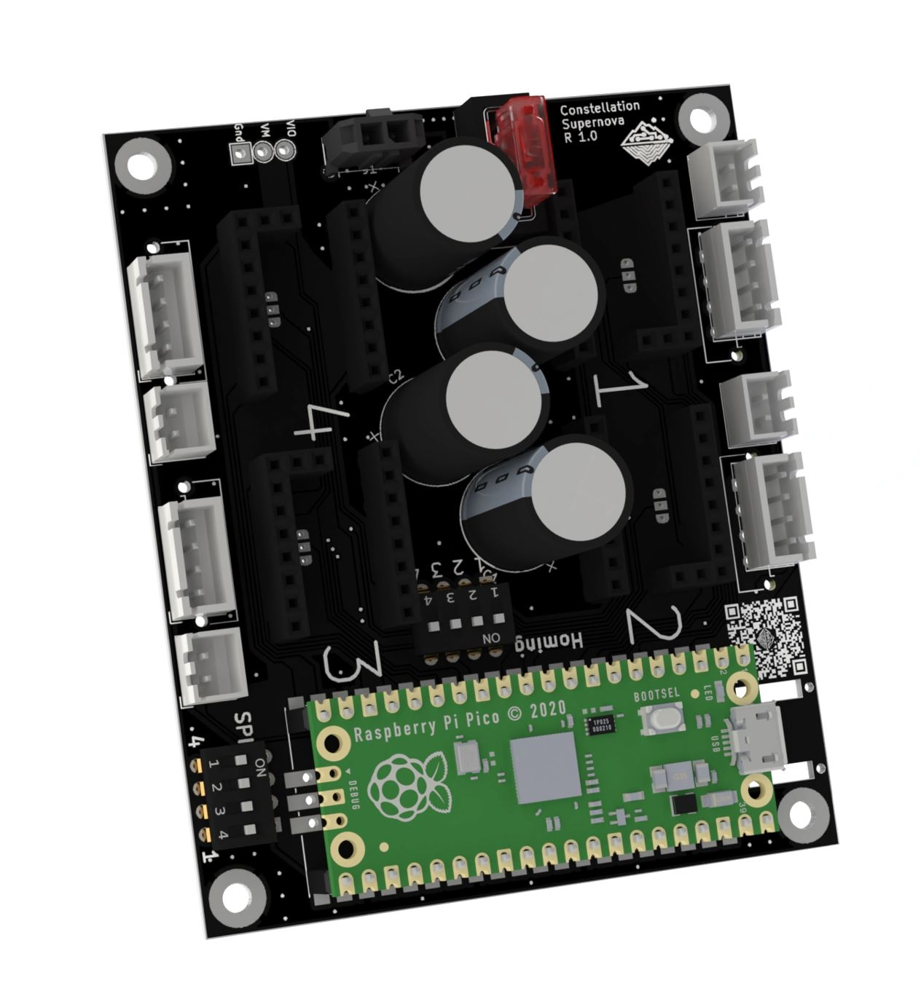
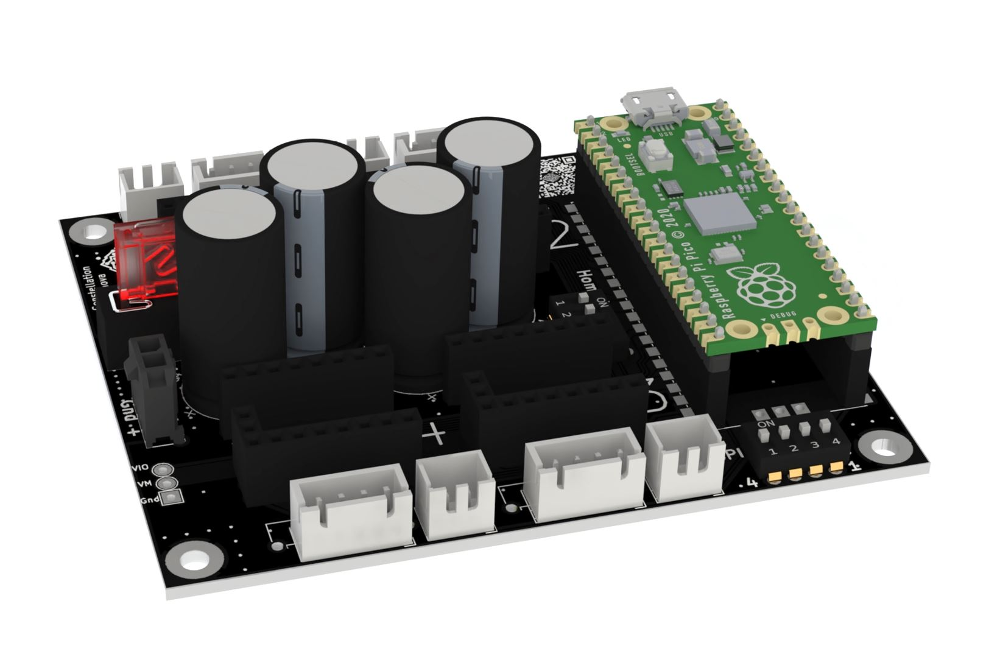
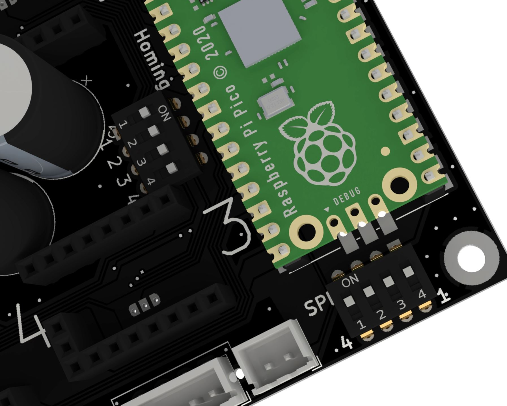

# Supernova R1 - FAQ


Assembled Constellation Supernova R1 with socketed Raspberry Pico.

## Warning
Using 48V electronics can cause serious harm on injury, only attempt to install this on your printer if you know what you are doing.

Under no circumstances we can be held responsible for harm or injury to any person or piece of equipment and you waiver all rights to hold us responsible for anything that happens as a result of using this design, or even thinking about the design.

## Motor Wiring & Current Limitations

Supernova is rated to handle a total of 10A current combined and up to 48v for all motors. However, most setups will not reach this limit.  
The limit for each individual motor is dependent on the motor itself and the stepper driver used.
When utilizing over 2A on a stepper it's highly recommended to use Microfit instead of JST XH for the stepper wiring.

## Stepper drivers
There are multiple HV-options (beyond 24V), the maximum safe voltage depends on the components the manufacturer puts on the board. This table is an overview for the most used driver chips, the maximum current they can handle (with sufficient cooling) and if they use SPI or UART.  
The following tables are for the step sticks of different manufacturers and which voltage is the maximum safe voltage recommended.  
The tables are using data which has been shamelessly copied from the fine folks at the [powerBrrr-github](https://github.com/tehmaze/PowerBRRR#stepper-drivers). All currents are specified as RMS.

| Driver chip | Max theoretical voltage | Max current | 'SPI' Dipswitch | 
|-|-|-|-|
| TMC2208 |  33V | 2A | Off for UART |
| TMC2209 |  25V | 2.8A | Off for UART |
| TMC2130 |  46V | 1.2A | On for SPI |
| TMC5160 |  **48V** | 3A | On for SPI |

#### BigTreeTech

| Product | Driver chip | Max safe voltage
|-|-|-|
| BigTreeTech TMC2130 | TMC2130 |  42V | 
| BigTreeTech TMC5160 | TMC5160 |  32V | 
| BigTreeTech TMC5160 Pro | TMC5160 |  **48V** | 
| BigTreeTech TMC2208 | TMC2208 |  33V | 
| BigTreeTech TMC2209 | TMC2209 |  25V | 

#### Fysetc
| Product | Driver chip | Max safe voltage
|-|-|-|
| Fysetc TMC2130 | TMC2130 | 42V |
| Fysetc TMC5160| TMC5160 | 32V | 
| Fysetc TMC5160 HV | TMC5160 | **48V** | 
| Fysetc TMC5160 QHV | TMC5160 | **48V** | 
| Fysetc TMC2208 | TMC2208 |  33V | 
| Fysetc TMC2209 | TMC2209 |  25V | 

#### Watterott
| Product | Driver chip | Max safe voltage
|-|-|-|
| Watterott TMC2130 | TMC2130 | 42V | 
| Watterott TMC5160 HV | TMC5160 | **48V** | 
| Watterott TMC2208 | TMC2208 | 33V |
| Watterott TMC2209 | TMC2209 | 25V | 

#### Other
| Product | Driver chip | Max safe voltage
|-|-|-|
| IdeaFormer TMC2130 V1.2 | TMC2130 | 42V |
| Mellow Fly TMC2209 | TMC2209 | 25V |
| Mellow Fly TMC5160 HV | TMC5160 | 42V |
| Mellow Fly TMC5160 HV Pro | TMC5160 | 42V |

## Sensorless Homing
To enable sensorless homing for e.g. Stepper 1 switch the Dipswitch labeled 'Homing' to **On* where '1' is written on the PCB  
Please note, that in the klipper-config most step sticks require diag0 to be set. However the following step sticks are known to require diag1 to be set (instead of diag0)
- Mellow TMC5160 HV
- Watterott TMC5160
- BigTreeTech TMC5160
- BigTreeTech TMC5160 Pro
  
## Dimensions
The board measures 90x75mm. The mounting holes are spaced apart 82/67mm. 

## Pinout


## Flashing Klipper to the Raspberry Pico


> :warning: **If you are using a Raspberry Pi model 4 for Klipper**: Get a good quality USB hub to connect the constellation hardware. The Pi model 4 has a mediocre USB chip that can cause issues in this setup.


To compile the micro-controller code, start by running these commands
on the Raspberry Pi:

```
cd ~/klipper/
make menuconfig
```

Select the Raspberry Pico as controller and review any other options provided. One can enable in the menu to turn on a green LED indicator when powered on. Once configured, run:

```
make
```

Once compiled transfer the .UF2 file to the storage of the Raspberry Pico. This can be done by holding down the button and connecting it to the computer. It will show up as storage device in your file explorer. When done copying to the device it will automatically unmount. The Raspberry Pico is now flashed and ready for use.

Enabling a green LED when powered on can also be done afterwards in the printer.cfg by adding the following:

```
[output_pin power_LED]
pin: gpio25
value: 1
```

## Gallery





## Sourcing
Links to purchase kits can be found here: [ANNEX Sourcing Guide](https://docs.google.com/spreadsheets/d/1aSM1jGxg-s0tyynyR3f8M0IQMXuXw57RJvoJbt98Clw/edit?usp=sharing)

Our discord server can be found here: 

[](https://discord.gg/MzTR3zE)
